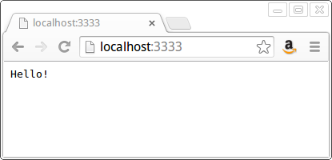
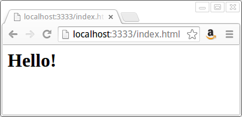
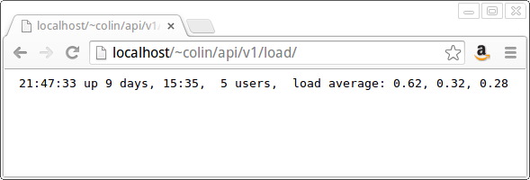
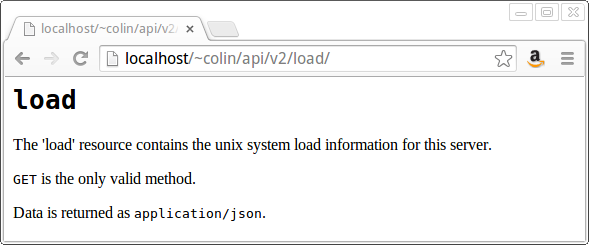
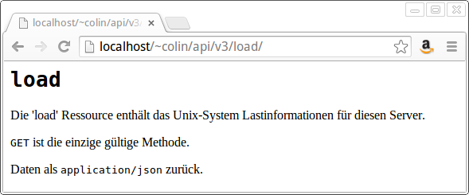

# It's simpler than you think. It's more complex than you think.

I've been doing web development for a pretty long time, but just over the last few years I've come to really appreciate the fundamentals of HTTP, what's going on under the hood when I'm building web applications. There are two sides of this. The first is that HTTP is in one sense a very simple protocol. It's just little text messages going back and forth between your browser and the web server. Whether I'm using Node or Django or some huge WSDL-driven Java XML-Beans monstrosity, what it's doing isn't rocket science; it's just taking care of a bunch of tedious, nit-picky bookkeeping that I don't want to be bothered with. If I really wanted to, I could just type the messages myself (and we'll get to that in a minute).

The practical upside of that is that you can use really simple tools to debug big, hairy, complex web applications. A few years ago, I was working in one of those Big Web Services systems with WSDL files and auto-generated Java code and layers and layers of middleware. We'd get some kind of error at the front end, and it'd be really hard to tell which piece had broken. So I ended up writing a bunch of really simple shell scripts to test the web services in isolation. I'd spackle together something using `curl`, `grep`, and `sed` that built up and picked apart the messages as text, without dragging in all that mess of Java code.

The flip side is that HTTP is actually a richer protocol than I'd realized. There's a lot I didn't know about it until I started building RESTful web services and trying to understand the "right" way to do it. There's all this stuff you can do with status codes and headers that I'd been re-implementing at the application level.

To take a recent example, I've been working on a web service that talks to other web services. Someone would make a call to us, we'd call the back-end services, they'd time out or barf up some sort of error, and we'd pass back a 500 error to our client. They'd see it and email us asking what was wrong with our service. It'd be nice to let them know it's not our fault and that they should pester the back-end systems people instead. We could send back a message body that says something like, "Back-end systems failure. Original error message follows," but it turns out we can say that just by returning a different status code. Not only is there a 502 status code, which means that a back-end system failed, but there's also a 504, which means that we timed out trying to contact it. That tells our client that they can try again in a little while and the request might go through.

Ok, enough talking. Now code.

## Goin' all Mechanical Turk on this

To illustrate the first point, that this is all just text, I'm going to play human web server, using `netcat`. If you're not familiar with it, it's a standard unix utility that just opens a network connection. Anything you type gets sent along it; anything that comes back gets printed out on your screen. I open up a terminal and type:

```
nc -l 3333
```

That starts up `netcat` listening on port 3333. Then I switch to my browser and tell it to go to `http://localhost:3333/`. The "page loading" indicator starts spinning. In the `netcat` terminal, I see:

```
GET / HTTP/1.1
Host: localhost:3333
Connection: keep-alive
Cache-Control: max-age=0
Accept: text/html,application/xhtml+xml,application/xml;q=0.9,image/webp,*/*;q=0.8
User-Agent: Mozilla/5.0 (X11; Linux i686) AppleWebKit/537.36 (KHTML, like Gecko) Chrome/36.0.1985.125 Safari/537.36
Accept-Encoding: gzip,deflate,sdch
Accept-Language: en-US,en;q=0.8
```

That's Chrome telling me it wants the root resource (`/`, which Apache or whatever would normally interpret as `index.html`). It's also telling me a lot about what kind of response it can handle. I'm going to ignore all that for now and just type:

```
HTTP/1.1 200 OK 
Content-type: text/plain
Content-length: 7

Hello!
```

Pretty straightforward. The content length is 7 because it includes the return character after "Hello!" Here's what we see in Chrome:



Switch back to the browser and go to `http://localhost:3333/index.html`. In the `netcat` terminal, we get a request that's much the same as before, except the first line is:

```
GET /index.html HTTP/1.1
```

Since they asked for HTML, I'll give them HTML. I type:
```
HTTP/1.1 200 OK
Content-type: text/html
Content-length: 16

<h1>Hello!</h1>
```

And in Chrome we see:



So at some fundamental level, that's all a web application is. It's a program that listens for a connection, gets little text messages, interprets them, and sends back responses. How simple can we make that?

## RESTful Web Services in Bash

How about this?

```bash
#!/bin/bash

echo "Content-type:text/plain"
echo 
uptime
```

`uptime` is a standard unix utility that reports how long the computer has been running and what the 1, 5, and 15 minute system load averages are. That's marginally useful - I've actually used a script much like this for basic server monitoring. Put it in a file, make it executable, run it from the command line, and it'll spit out something like:

```
Content-type:text/plain

 21:29:32 up 9 days, 15:17,  5 users,  load average: 0.05, 0.10, 0.18
```

From here, if you want to follow along, you'll need to have Apache set up and configured to let you run CGI scripts in the directory you're working in. (That's a whole tutorial on its own, but here's some [instructions for Mac OS X](http://www.cgi101.com/book/connect/mac.html). Otherwise, Google for "apache enable cgi" and your operating system.)

On my machine, this script is saved as `public_html/api/v1/load/index.cgi`. That lets me access it as `http://localhost/~colin/api/v1/load/`, as we can see in Chrome:



We can also use `netcat` in place of Chrome. Instead of listening on a port, we open a connection to the web server's port:

```
$ netcat localhost 80
```

Then I type:

```
GET /~colin/api/v1/load/ HTTP/1.1
Host: localhost
```

And I get this back from Apache:

```
HTTP/1.1 200 OK
Date: Wed, 27 Aug 2014 01:14:11 GMT
Server: Apache/2.4.7 (Ubuntu)
Vary: Accept-Encoding
Transfer-Encoding: chunked
Content-Type: text/plain

46
 21:14:19 up 9 days, 15:01,  5 users,  load average: 0.08, 0.18, 0.28

0
```

You can see that Apache includes a bunch of header fields that I didn't bother to when I was playing web server. (I'll trim most of these out of later examples to cut down on the clutter.) The more interesting thing is that it doesn't have a `Content-length` header. What it has instead is `Transfer-Encoding: chunked`. That says that its content will be in chunks, prefixed by their size (in hexadecimal). 46 hex is 70, which is the length of the next line (again, counting the return character at the end). The '0' for the next chunk says, "that's all, folks!"

We can make this a little easier on ourselves by using `curl` instead of `netcat`. It's a somewhat more custom tool for making HTTP requests. We can just run `curl -si http://localhost/~colin/api/v1/load/` from the command line, and get back:

```
HTTP/1.1 200 OK
Transfer-Encoding: chunked
Content-Type: text/plain

 22:05:42 up 9 days, 15:53,  5 users,  load average: 0.14, 0.13, 0.19
```

That's the same as what `netcat` gave us (minus the header clutter), but notice that it combined the chunked response for us. Even at this level, some of the details are being hidden.

## Status Seeking

Let's take this a step further. The [status script](v1/status/index.cgi) gets a status message ("GREEN", "YELLOW", or "RED") from a file, and prints it out like so:

```
$ curl -si http://localhost/~colin/api/v1/status/
HTTP/1.1 200 OK
Content-Length: 4
Content-Type: text/plain

RED
```

It also lets us set a new status like so:

```
$ curl -si -X PUT -d GREEN http://localhost/~colin/api/v1/status/
HTTP/1.1 204 No Content
Content-Length: 0
Content-Type: text/plain
```

Note that we used the same URL, but changed the HTTP method to `PUT` (instead of the default `GET` - don't ask me why that's the `-X` option) and specified "GREEN" as the data (`-d`) to be sent along with the request. We get back an exciting new response code: 204! Since we're telling not asking, it doesn't make much sense for the server to send anything back. The 204 status just says, "That thing you were doing? It worked." No reason to have a message body saying "Success!" when the code already tells you that. I've definitely been guilty of reinventing that wheel before I ran across this.

What if we try to send a bad status, like 'BLUE'?

```
$ curl -si -X PUT -d BLUE http://localhost/~colin/api/v1/status/
HTTP/1.1 400 Bad Request
Content-Type: text/plain

Invalid status code
```

400 is the "your mistake" error code, which is pretty generic, so we include a descriptive message in the response body. Since it's a user error, it's reasonable to just have a human-readable message.

If you look at the script, you'll see references to environment variables like `$REQUEST_METHOD`. That's how Apache makes information about the request avaliable to the script (as part of the CGI standard). In case you want to see all of them, I've added an [env script](env/index.cgi), which dumps them all out, plus the content. You can hit it with Chrome or `curl`, or even `netcat`. See what's different between them.

## API Documentation

Ok, great! Now we have two simple yet useful web services. But they're not so simple that they don't need any documentation, so let's add some. We could have some sort of parallel hierarchy for documentation, like `/api/docs/v1/load/`, etc., but that's kinda clunky. Instead, let's rework our services so they give you data when you ask for data, and text when you ask for text. For that, we take advantage of the `Accept` header. Take a look at [the script](v2/load/index.cgi) to see all the details, but it's basically a bunch of if-then-else clauses checking `$HTTP_ACCEPT`.

Now when we point `curl` at the new version of the 'load' service, we normally get:

```
$ curl -si http://localhost/~colin/api/v2/load/
HTTP/1.1 200 OK
Content-Type: text/plain

LOAD
The 'load' resource contains the unix system load information for this server.
GET is the only valid method.
Data is returned as application/json.
```

But if we add the `Accept` header saying we want JSON data, we get:

```
$ curl -si -H 'Accept: application/json' http://localhost/~colin/api/v2/load/
HTTP/1.1 200 OK
Date: Wed, 27 Aug 2014 03:48:48 GMT
Server: Apache/2.4.7 (Ubuntu)
Transfer-Encoding: chunked
Content-Type: application/json

{"load": {"1": 0.09, "5": 0.13, "15": 0.20}}
```

Sweet! And when we use Chrome, which asks for `text/html`, we get:



## Auf Deutsch!

If you hit the `env` script with Chrome, one of the environment variables you see is `HTTP_ACCEPT_LANGUAGE`, which corresponds to the `Accept-language` header. So by setting a header field, we can tell the server what language we want the response in. Again, something that I probably would have re-implemented in the message body in a totally ad-hoc way, instead of using the [standard language codes](https://www.ietf.org/rfc/rfc1766.txt). For my browser, the language code is `en-US` - American English. Just for kicks (since Google Translate makes it easy and my girlfriend knows enough German to sanity-check it), let's translate the `load` script documentation into German, and display that if the `Accept-language` header begins with 'de'. Take a look at [that version of the load script](v3/load/index.cgi) to see the details.

When I hit `v3/load/` in the browser, it looks the same. But then I (temporarily) switch my language preference to German (Google to see how to do that) and reload the page, and I get:



If I go back and hit the `env` script, I see `HTTP_ACCEPT_LANGUAGE` is now `de,en-US;q=0.8,en;q=0.6`. (`q` is strength of preference, so `de` at 100%, `en-US` at 80%, plain `en` at 60%. I cheat and just look at the first two letters.)

## Caching

This is one that I recently avoided re-implementing. We were developing an iPhone app that used a data file that wouldn't change often, but did need to be kept up to date. It was a couple megabytes - more than we'd want to have to fetch every time the app starts up. We were talking about all sorts of ways of doing that before I thought, "Hey, isn't this essentially a content caching problem? I bet there's some sort of mechanism built into HTTP for that." It turns out that's an understatement - there's all kinds of caching schemes built into HTTP.

The simplest and most generally useful involves the `ETag` header. This is a unique identifier generated by the server and included in the response headers. Apache does it automatically for static files. For example, if you fetch this file (the one you're reading) with `curl`, you'll see a header block like this:

```
$ curl -si http://localhost/~colin/api/narrative.md 
HTTP/1.1 200 OK
Date: Thu, 28 Aug 2014 11:23:58 GMT
Server: Apache/2.4.7 (Ubuntu)
Last-Modified: Thu, 28 Aug 2014 11:23:43 GMT
ETag: "3796-501aec4f3f942"
Accept-Ranges: bytes
Content-Length: 14230
```

Then the next time you request that page, include an `If-None-Match` header with that `ETag` value. That tells the server to only return the contents if the `ETag` value it calculates doesn't match. (Note that the quotes are important!) If it's still the same, it returns a 304 status code, like so:

```
$ curl -si -H 'If-None-Match: "3796-501aec4f3f942"' http://localhost/~colin/api/narrative.md 
HTTP/1.1 304 Not Modified
Date: Thu, 28 Aug 2014 11:25:57 GMT
Server: Apache/2.4.7 (Ubuntu)
ETag: "3796-501aec4f3f942"
```

Apache doesn't set an `ETag` header for script responses (because they're expected to be different every time), so we'll have to implement this ourselves. Fortunately, that's pretty easy. I just run the status contents through the `sha1sum` utility, which calculates a unique number based on them. (_How_ it does that is a whole 'nother article.) Amazingly, this turns out to be slightly faster than getting the modification time for the file. That section of the code looks like:

```bash
        etag=`echo $status | sha1sum | cut -d ' ' -f 1`
        if [ "$HTTP_IF_NONE_MATCH" == "$etag" ] ; then
            echo "Content-type: text/plain"
            echo "Status: 304"
            echo
        else
            echo "Content-type: application/json"
            echo "ETag: $etag"
            echo
            echo '{"status": "'$status'"}'
        fi  
```

Pretty simple, huh?

## Onward!

If you want to learn more about this, Wikipedia is a good place to start, as always. They've pulled together info on all the [status codes](http://en.wikipedia.org/wiki/List_of_HTTP_status_codes) and [header fields](http://en.wikipedia.org/wiki/List_of_HTTP_header_fields), as well as an [in-depth overview of HTTP](http://en.wikipedia.org/wiki/Hypertext_Transfer_Protocol). Yahoo! also has a nicely concise [summary of what the status codes mean and when to use them](https://developer.yahoo.com/social/rest_api_guide/http-response-codes.html).

So if you're new to web development and web services, hopefully they're a little less intimidating now. If you're an old hand, maybe you've picked up some new tools and techniques for debugging. If you haven't already, play around with `netcat`, be a Human Web Server, get it into your fingers. Make `curl` part of your toolbox. For both, take some time to explore what else they can do. Next time you're designing web applications or services, consider whether you're reinventing the wheel or making things more complicated than they need to be.

Have the courage to build simple things.
